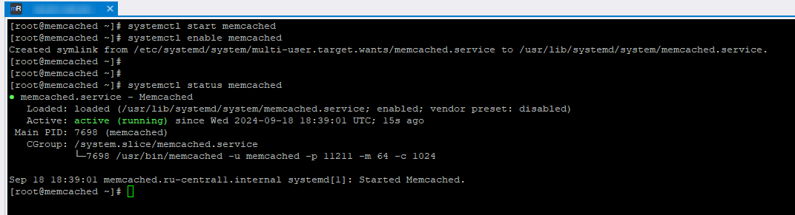
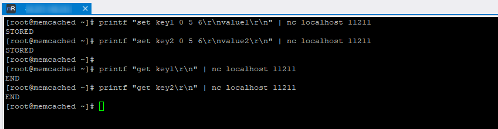
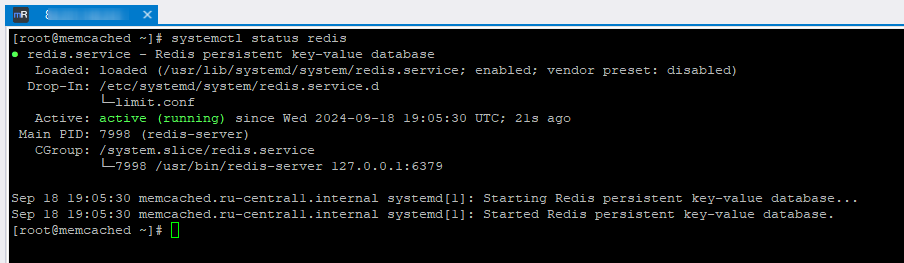
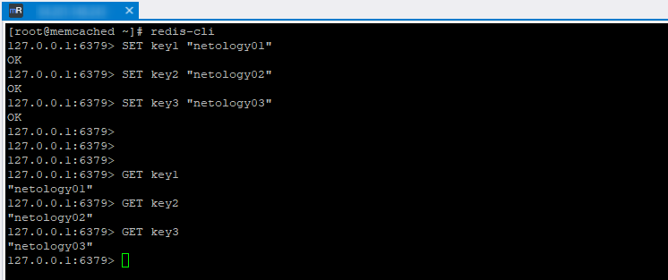
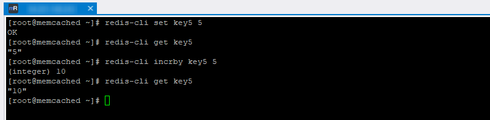

# Домашнее задание к занятию "`Кеширование Redis/memcached`" - `Дедюрин Денис`

---

## Задание 1. Кеширование

Приведите примеры проблем, которые может решить кеширование.

Приведите ответ в свободной форме.

### Ответ:

### Кеширование — это метод хранения часто запрашиваемых данных в быстром доступном месте, чтобы улучшить производительность и снизить нагрузку на систему. Вот несколько примеров проблем, которые кеширование может решить:

**Снижение времени отклика:** Когда данные запрашиваются часто, кеширование их в памяти или на быстром хранилище (например, в Redis или Memcached) позволяет значительно сократить время доступа. Это особенно полезно для веб-приложений и API, где пользователи ожидают быстрый отклик.

**Снижение нагрузки на базу данных:** Часто запрашиваемые данные могут быть кешированы, чтобы уменьшить количество обращений к базе данных. Это снижает нагрузку на базу данных, улучшая её производительность и увеличивая время отклика для других запросов.

**Улучшение производительности веб-сайтов:** Кеширование может использоваться для хранения HTML-страниц, изображений или других статических ресурсов. Это снижает количество запросов к серверу и ускоряет загрузку страниц для пользователей.

**Оптимизация сетевого трафика:** Кеширование данных на уровне прокси-сервера или CDN может снизить количество данных, передаваемых через интернет, и уменьшить задержки, связанные с сетевыми запросами.

**Снижение затрат на обработку:** Кеширование результатов сложных вычислений или запросов помогает избежать повторных вычислений, что может значительно сократить затраты на обработку данных и улучшить общую эффективность системы.

**Заключение:** Кеширование помогает ускорить доступ к данным, уменьшить нагрузку на ресурсы и улучшить пользовательский опыт.

---
## Задание 2. Memcached
Установите и запустите memcached.

Приведите скриншот systemctl status memcached, где будет видно, что memcached запущен.

### Ответ:

Установка:
```
yum install memcached -y
```

Запуск и добавление memcached в автозапуск:
```
systemctl start memcached
systemctl enable memcached
```

Вывод статуса memcached:
```
systemctl status memcached
```


---
## Задание 3. Удаление по TTL в Memcached
Запишите в memcached несколько ключей с любыми именами и значениями, для которых выставлен TTL 5.

Приведите скриншот, на котором видно, что спустя 5 секунд ключи удалились из базы.

### Ответ:

Дополнительно установим nc(netcat) для отправки и получения данных через сетевые соединения.
```
yum install nc -y
```
Далее выполним команды записи ключей с TTL5:
```
printf "set key1 0 5 6\r\nvalue1\r\n" | nc localhost 11211
STORED
printf "set key2 0 5 6\r\nvalue2\r\n" | nc localhost 11211
STORED
```

И проверим значения после истечения 5 секунд:
```
printf "get key1\r\n" | nc localhost 11211
END
printf "get key2\r\n" | nc localhost 11211
END
```


---
## Задание 4. Запись данных в Redis
Запишите в Redis несколько ключей с любыми именами и значениями.

Через redis-cli достаньте все записанные ключи и значения из базы, приведите скриншот этой операции.

### Ответ:

Установим Redis, выполнив следующие команды:
```
yum install epel-release -y
yum install redis -y
systemctl enable redis
systemctl start redis
```
Проверим его статус командой:
```
systemctl status redis
```


Открываем командную строку Redis:
```
redis-cli
```
И запишем несколько ключей с любыми именами и значениями:
```
SET key1 "netology01"
SET key2 "netology02"
SET key3 "netology03"
```

Теперь, для того чтобы прочитать эти ключи выполним следующие команды:
```
GET key1
GET key2
GET key3
```


---
## Задание 5*. Работа с числами
Запишите в Redis ключ key5 со значением типа "int" равным числу 5. Увеличьте его на 5, чтобы в итоге в значении лежало число 10.

Приведите скриншот, где будут проделаны все операции и будет видно, что значение key5 стало равно 10.

### Ответ:

Можно и не заходить в командную строку **redis-cli**, чтобы записывать и считывать ключи. Для этого достаточно выполнить следующие команды:
Записываем ключ:
```
redis-cli set key5 5
```
Проверяем значение ключа:
```
redis-cli get key5
```
Увеличиваем на 5:
```
redis-cli incrby key5 5
```
Снова проверяем значение ключа:
```
redis-cli get key5
```

